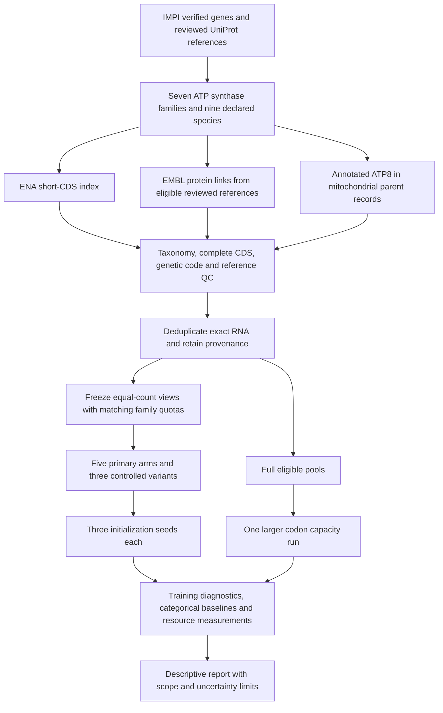

# Navigating the secondary experiment



## Questions and implementation

| Question | Executable or record | Check |
|---|---|---|
| Which families and organisms are allowed? | `configs/secondary/biology.json` | Reviewed reference mapping; IMPI compound-symbol resolution |
| Which sequences actually exist? | `secondary_acquire.py`, `secondary_genomes.py` | Counted inventories, source receipts, accession versions, no silent API omissions |
| Are they eligible? | Acquisition QC and rejection ledgers | Complete unambiguous CDS, own-species length/identity, appropriate translation table |
| Is a sequence being counted twice? | Global RNA SHA-256 merge | Preserve every accession route; one CDS per unique RNA |
| Are comparisons controlled? | `secondary_data.py`, `cohorts.json` | Equal counts; shared family quotas; selection seed separate from optimizer seeds |
| What fits this computer? | `scripts/profile_secondary.py`, `hardware-benchmark.json` | Bounded synthetic forward/backward measurements and memory reserve |
| What changes between arms? | `plan.json`, `training.json` | Objective and position controls plus a bundled architecture comparison on the same vertebrate cohort; full-pool run explicitly separate |
| Can interrupted runs resume? | `secondary_train.py`, `scripts/run_secondary.py` | Full state, exact CPU resume tests, frozen input hashes, aggregate time budget |
| Do saved models match the reported runs? | `scripts/audit_secondary_checkpoints.py`, `checkpoints.json` | Strict model-state loading, finite weights, completed update/exposure identity, checkpoint file hashes |
| What do the measurements establish? | `scripts/build_secondary_report.py`, `report.md` | Training fit only; every seed reported; baseline and subgroup comparisons |

## Commands

Run from the repository root with the existing environment. No held-out partition is created.

```powershell
.venv\Scripts\python.exe scripts/build_secondary_data.py
.venv\Scripts\python.exe -m pytest -q
.venv\Scripts\python.exe scripts/run_secondary.py --freeze-only
.venv\Scripts\python.exe scripts/build_secondary_report.py --data-only
.venv\Scripts\python.exe scripts/run_secondary.py
.venv\Scripts\python.exe scripts/audit_secondary_checkpoints.py
.venv\Scripts\python.exe scripts/build_secondary_report.py
```

The acquisition downloads are public but potentially several gigabytes; cached copies are checksum-verified. On a fresh checkout, first run `python scripts/restore_secondary_snapshot.py` to request the recorded source URLs and enforce the original content hashes, then rebuild the cohorts. Keep the raw archive for exact source reproduction if the provider changes its responses. Changes to eligibility, sources or model settings require a new experiment version rather than replacing an existing frozen cohort or run. Secondary manifests use canonical UTF-8/LF bytes so their hashes survive Git checkout on Windows and Linux.

## Artifact layout

- `data/raw/secondary/`: the first two acquisition routes, reference inventory, receipts and rejection ledger.
- `data/raw/secondary/genomes/`: the third route, parent inventories/records, extraction evidence and enriched pool.
- `data/processed/secondary/<view>/`: compact frozen `cohort.jsonl`, its manifest and fitted categorical baselines. Complete accession provenance remains once in the enriched pool; join by `sequence_sha256`, with the pool checksum recorded in each view's manifest. Training does not load large accession histories into RAM.
- `runs/secondary/<arm>-seed<seed>/`: model configuration, diagnostic history, rolling checkpoint and completed final checkpoint.
- `reports/secondary/`: compact input manifests, frozen run plan, execution status, results, figures and source registry.

The original `data/processed`, `runs/pilot` and first-pilot reports remain separate. Source-code hashes in archived first-pilot runs refer to the first implementation; reproducing that exact engine requires the corresponding original Git commit.
