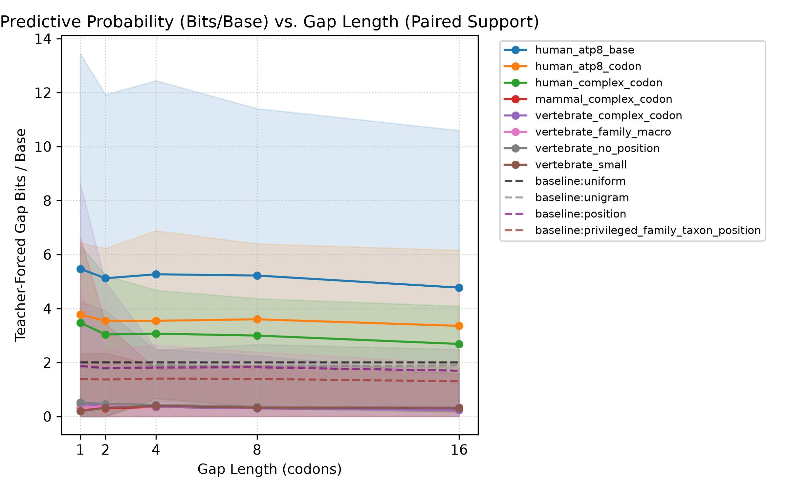
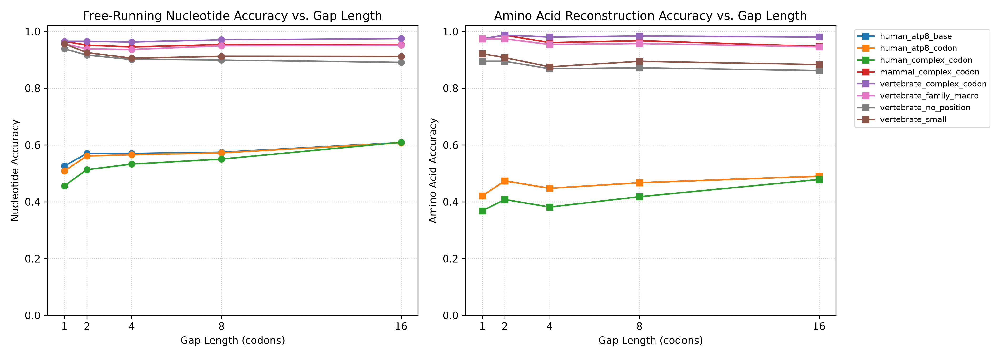
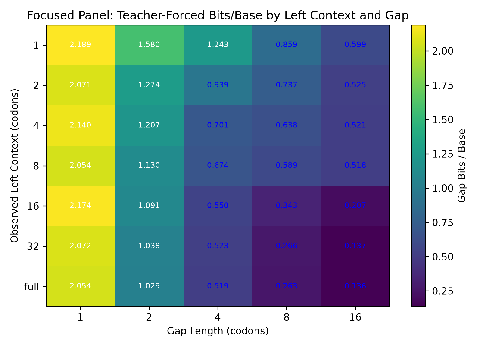
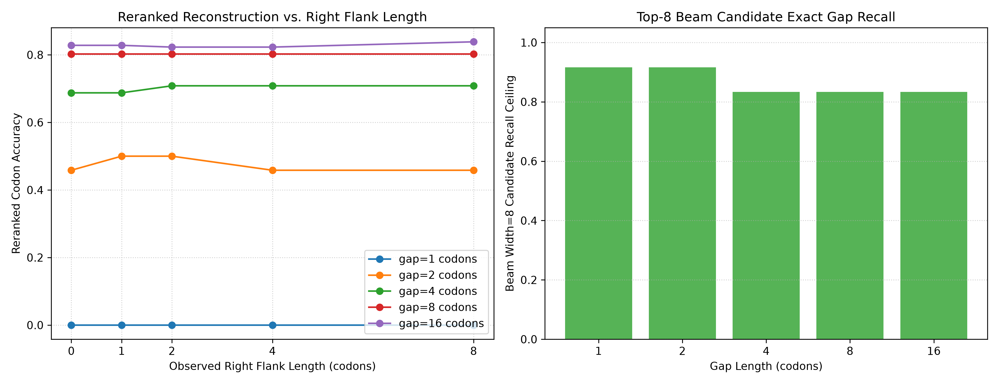
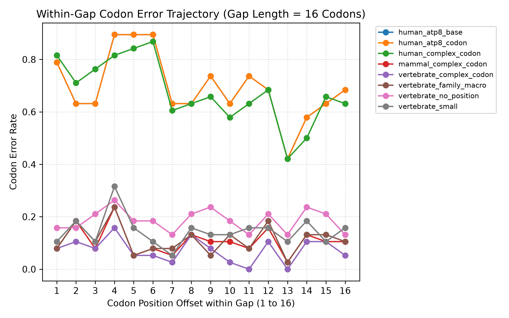

# Prospective Gap Completion and Evaluation Report

**Generated**: 2026-09-25T16:04:46.054130+00:00
**Execution Status**: COMPLETED
**Total Evaluations Stored**: 2366
**Total Models Evaluated**: 16
**Elapsed Wall Time**: 47.22s

## 1. Scope, Protocol & Integrity Controls

This evaluation strictly adheres to [`docs/gap-evaluation-protocol.md`](file:///c:/Users/jddub/OneDrive/Desktop/Small%20microprotein%20next%20codon%20prediction%20modeling%20using%20LLM%20trainging%20techniques/docs/gap-evaluation-protocol.md).
Key controls enforced:
- **Zero Sequence/Source Accession Leakage**: 100% of 20 holdout test CDS are verifiably disjoint from the 533 training-sequence union.
- **Immutable Pretraining Checkpoints**: 100% of completed 2,000-update checkpoints pass SHA-256 and tensor state audits.
- **Causal Execution & KV-Cache Equivalence**: Inferences run under `torch.inference_mode()` with zero state mutation.
- **Outcome-Blind Candidate Banks**: Candidate beams (width=8) are frozen prior to suffix scoring.

## 2. Test Cohort & Biological Support

| Family | Taxon (NCBI Tax ID) | Genetic Code | Untouched CDS Count | Own-Species Reviewed Reference Identity |
|---|---|---|---|---|
| ATP8 | Cattle (*Bos taurus*, 9913) | Table 2 (Mito) | 17 | >= 95% |
| ATP8 | Human (*Homo sapiens*, 9606) | Table 2 (Mito) | 1 | >= 95% |
| ATP5F1E | Mouse (*Mus musculus*, 10090) | Table 1 (Nuclear) | 1 | >= 95% |
| ATP5ME | Mouse (*Mus musculus*, 10090) | Table 1 (Nuclear) | 1 | >= 95% |

## 3. Key Scientific Endpoints

### 3.1 Predictive Probability (Teacher-Forced Bits / Base)

### 3.2 Free-Running Reconstruction Accuracy & Premature Stops

### 3.3 Left Context Length & Position Encoding Diagnostic

### 3.4 Right-Flank Candidate Beam Reranking & Recall Ceilings

### 3.5 Error Accumulation & Trajectories

## 4. Limitations & Uncertainty Disclosure

> [!IMPORTANT]
> **Sparse Taxa Uncertainty**: Because the Human ATP8 and Mouse strata contain < 5 cluster components, bootstrap uncertainty bands are omitted for those strata in favor of explicit point estimates, seed ranges, and support count tables per protocol specifications.

## 5. Artifact & Manifest Provenance
- **Test Manifest SHA-256**: `11ebad367daafe929007c1b20f727fbb89741bdff3e99492fc2834cbe353b577`
- **Plan SHA-256**: `173e6daeb95348cb88742f8603a26ecabcfc4f1c13d1f13ef711ca22ab67a064`