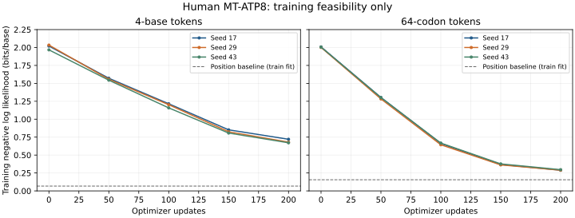

# Pilot results — training only

All six prespecified runs completed 200 optimizer updates on the same 129 human MT-ATP8 coding sequences. Every run reduced training loss from initialization. These are training-set diagnostics, not unseen-sequence accuracy.

| Arm | Seed | Parameters | Initial bits/base | Final bits/base | Seconds |
|---|---:|---:|---:|---:|---:|
| base | 17 | 56,832 | 2.0202 | 0.7201 | 20.6 |
| codon | 17 | 59,712 | 2.0080 | 0.2892 | 4.0 |
| base | 29 | 56,832 | 2.0338 | 0.6801 | 19.3 |
| codon | 29 | 59,712 | 2.0016 | 0.2885 | 4.3 |
| base | 43 | 56,832 | 1.9671 | 0.6710 | 20.6 |
| codon | 43 | 59,712 | 2.0058 | 0.2961 | 4.2 |

Each run saw 3,200 sequence presentations (24.81 presentations per unique CDS) and 652,800 target nucleotides. The two arms used the same biological examples, seed-specific sampling order and update budget. Attention cost and output-class count differ.

The curves show each seed separately. They are not uncertainty intervals over biological populations. Timing includes training-corpus diagnostics after initialization and checkpoint writing.

## Interpretation

- base: final training bits/base mean **0.6904**, sample SD **0.0261** across three initialization seeds.
- codon: final training bits/base mean **0.2912**, sample SD **0.0042** across three initialization seeds.

The codon arm fit the training corpus more quickly under this fixed update/exposure budget. This is an optimization observation, not evidence that codon tokenization predicts new biological sequences better.

| Training-fit baseline | Base bits/base | Codon bits/base |
|---|---:|---:|
| uniform | 2.0000 | 2.0000 |
| unigram | 1.7798 | 1.6027 |
| bigram | 1.7444 | 0.5424 |
| position | 0.0674 | 0.1555 |

**Neither transformer surpassed its corresponding smoothed positional baseline.** A close single-gene cohort is largely predictable by nucleotide/codon position; transformer loss reduction alone is weak evidence of useful biological modeling. No hyperparameter winner, functional claim, gap-completion accuracy or structural accuracy is established.

The cohort has **92 variable nucleotide positions** and **98.49% mean pairwise nucleotide identity**. 61 sequences encode exactly the reviewed reference protein. These observations explain the strong position baseline and limit the effective diversity of 129 distinct CDS.

All 64 codon classes are represented in the encoder and model head; `codon-coverage.csv` records which classes actually occurred. Unobserved classes have no positive training examples. Vocabulary coverage must not be confused with observed-data coverage.

## Artifacts and checks

- `pilot-results.json`: per-run initial/final metrics, exposures and timings.
- `pilot-runs.json`: full loss histories, executable settings, source hashes and environment.
- `source-registry.json` and `data-manifest.json`: input retrieval and cohort identity.
- Local `runs/pilot/<arm>-seed<seed>/checkpoint.pt`: model, optimizer and RNG states.
- Offline software tests verify vocabulary, biological QC, boundaries, causality, corruption rejection and exact CPU resume.

The pilot ran on CPU with Python 3.12.14 and PyTorch 2.14.0. Validation, final testing, gap filling, AlphaFold and PyMOL were not run.
