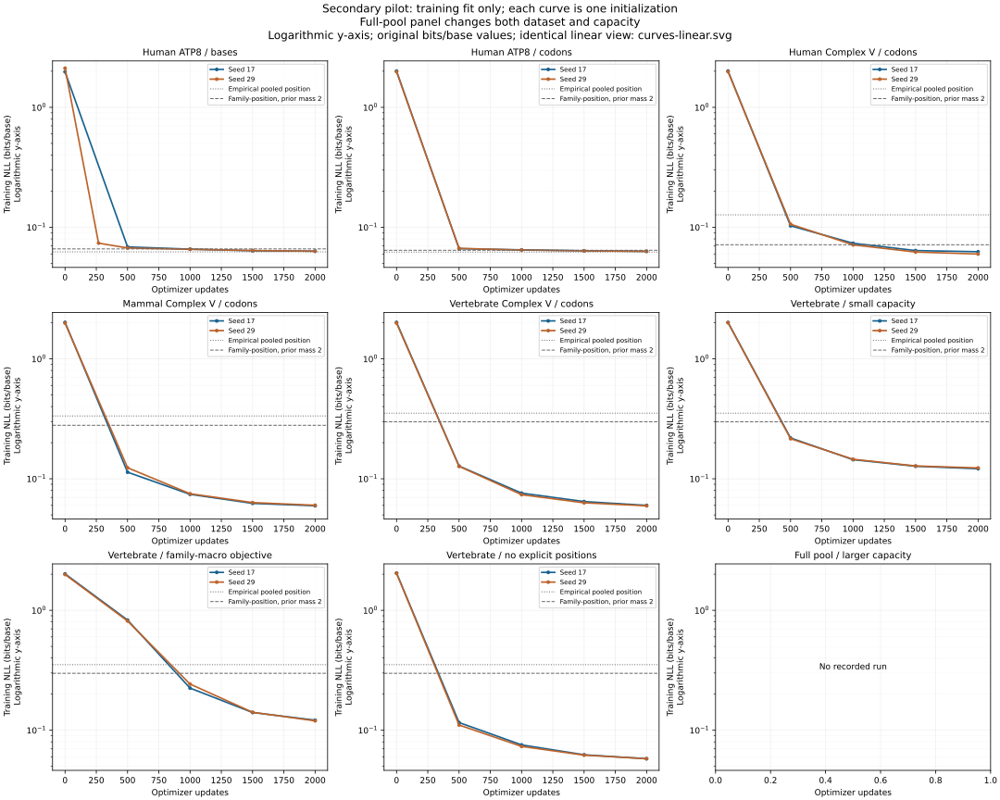

# Secondary pilot — training only

TRAINING ONLY; all diagnostics are resubstitution, with no held-out observations.

**8 of 25 planned runs completed their fixed update budgets.** 0 recorded runs are partial; 17 have no reported result. Partial runs are excluded from completed-run averages. A pending seed is not a failed scientific hypothesis.

The aggregate execution budget is 4 hours. Recorded scheduler wall time is 57.4 minutes. Run-loop timings below include interval diagnostics and checkpoints but exclude setup/initial diagnostics; scheduler time covers the broader execution.

Scheduler status: **running**. Work is still running or its last recorded controller state is active.

## Data and controlled comparisons

| Frozen view | Distinct CDS | Distinct peptides | Families | Taxon strata | Target bases/pass | Variable target bases | Target codons observed / 64 |
|---|---:|---:|---:|---:|---:|---:|---:|
| full_human | 422 | 185 | 7 | 1 | 86,262 | 84,096 | 64 |
| full_mammal | 524 | 244 | 7 | 6 | 106,884 | 88,803 | 64 |
| full_vertebrate | 533 | 250 | 7 | 9 | 108,345 | 88,929 | 64 |
| human_atp8 | 412 | 178 | 1 | 1 | 84,048 | 84,048 | 57 |
| human_complex | 412 | 182 | 7 | 1 | 84,222 | 82,056 | 64 |
| mammal_complex | 412 | 201 | 7 | 6 | 83,859 | 70,125 | 64 |
| vertebrate_complex | 412 | 206 | 7 | 9 | 83,532 | 69,432 | 64 |

The family expansion replaces **10/412 CDS (2.43%)**; the mammalian expansion replaces **85/412 (20.63%)**; the nonmammalian expansion replaces **9/412 (2.18%)**. Nonmammalian additions are ATP8 only. Small replacement fractions limit what aggregate losses reveal about broader diversity.

The five primary arms vary tokenization or cohort composition. The three additional controls change capacity, family-macro loss weighting, or explicit positional encoding on exactly the same vertebrate cohort. Uniform sequence draws and matched update budgets control presentations; natural lengths make nucleotide exposure differ. The larger full-pool run changes both capacity and data and is an engineering demonstration.

## Completed matched runs

Values are mean ± sample standard deviation across completed initialization seeds, not confidence intervals or biological replicates. The completed/planned column exposes missing seeds. No model is selected by minimum training loss.

| Arm | Completed/planned | Parameters | Updates | Initial bits/base | Final bits/base | Final family-macro bits/base | Final variable-codon bits/base | Variable target bases |
|---|---:|---:|---:|---:|---:|---:|---:|---:|
| Human ATP8 / bases | 1/3 | 1,780,608 | 2,000 | 1.9764 (n=1; SD n/a) | 0.0632 (n=1; SD n/a) | 0.0632 (n=1; SD n/a) | 0.0632 (n=1; SD n/a) | 84,048 |
| Human ATP8 / codons | 1/3 | 1,792,128 | 2,000 | 2.0066 (n=1; SD n/a) | 0.0630 (n=1; SD n/a) | 0.0630 (n=1; SD n/a) | 0.0630 (n=1; SD n/a) | 84,048 |
| Human Complex V / codons | 1/3 | 1,792,128 | 2,000 | 2.0067 (n=1; SD n/a) | 0.0626 (n=1; SD n/a) | 0.0575 (n=1; SD n/a) | 0.0630 (n=1; SD n/a) | 82,056 |
| Mammal Complex V / codons | 1/3 | 1,792,128 | 2,000 | 2.0127 (n=1; SD n/a) | 0.0595 (n=1; SD n/a) | 0.0617 (n=1; SD n/a) | 0.0645 (n=1; SD n/a) | 70,125 |
| Vertebrate Complex V / codons | 1/3 | 1,792,128 | 2,000 | 2.0123 (n=1; SD n/a) | 0.0600 (n=1; SD n/a) | 0.0605 (n=1; SD n/a) | 0.0648 (n=1; SD n/a) | 69,432 |
| Vertebrate / small capacity | 1/3 | 59,712 | 2,000 | 2.0072 (n=1; SD n/a) | 0.1212 (n=1; SD n/a) | 1.3982 (n=1; SD n/a) | 0.0781 (n=1; SD n/a) | 69,432 |
| Vertebrate / family-macro objective | 1/3 | 1,792,128 | 2,000 | 2.0123 (n=1; SD n/a) | 0.1212 (n=1; SD n/a) | 0.0464 (n=1; SD n/a) | 0.1011 (n=1; SD n/a) | 69,432 |
| Vertebrate / no explicit positions | 1/3 | 1,792,128 | 2,000 | 2.0419 (n=1; SD n/a) | 0.0579 (n=1; SD n/a) | 0.0694 (n=1; SD n/a) | 0.0619 (n=1; SD n/a) | 69,432 |

Every plotted curve represents one initialization. Dashed family-position baselines receive privileged family labels. There is no held-out curve. Base/codon token accuracy and raw token perplexity are not compared.

Variable-codon masks are cohort-specific. The base/codon pair shares the same biological support; the three vertebrate controls share their reference arm's support. Across different cohorts, changing support prevents a paired accuracy interpretation. This mask counts every observation at a variable position, not only minority codons. Every target codon position varies at least once in `human_atp8`; variable-position and overall fit are identical there, so this diagnostic does not resolve rare-variant performance.

## Controlled contrasts and prespecified expectations

Differences follow the subtraction order in each row and are paired by initialization seed. Positive values mean higher training negative log likelihood for that metric. These are descriptive optimization contrasts, not significance tests.

Met/reversed describes only the frozen directional training expectation evaluated on the mean paired difference. Missing seed pairs make that interpretation provisional. No direction was asserted for raw loss across different taxonomic cohorts. The capacity contrast changes width, depth and heads together; it is not a single-dimension intervention.

| Contrast | Complete/planned pairs | Overall delta bits/base | Family-macro delta bits/base | Variable-codon delta bits/base | Prespecified expectation | Mean-pair outcome |
|---|---:|---:|---:|---:|---|---|
| Tokenization: codon minus base | 1/3 | -0.000218 (n=1; SD n/a) | -0.000218 (n=1; SD n/a) | -0.000218 (n=1; SD n/a) | Codon lower overall bits/base | Provisional: met (missing seed pairs) |
| Capacity: small minus standard | 1/3 | 0.061231 (n=1; SD n/a) | 1.337671 (n=1; SD n/a) | 0.013271 (n=1; SD n/a) | Small architecture higher overall bits/base | Provisional: met (missing seed pairs) |
| Family weighting: macro minus token | 1/3 | 0.061259 (n=1; SD n/a) | -0.014070 (n=1; SD n/a) | 0.036261 (n=1; SD n/a) | Family-macro objective lower family-macro bits/base | Provisional: met (missing seed pairs) |
| Explicit position: removed minus supplied | 1/3 | -0.002071 (n=1; SD n/a) | 0.008943 (n=1; SD n/a) | -0.002908 (n=1; SD n/a) | Removed positions higher overall bits/base | Provisional: reversed (missing seed pairs) |

Each matched pair below has verified identical cohort, sampling trace, updates, sequence/base presentations, family exposures and scored supports. Variable support is comparable within each pair only.

| Contrast | Seed | Overall delta bits/base | Family-macro delta bits/base | Variable-codon delta bits/base | Variable target bases | Sequence presentations | Target bases presented | Seed expectation |
|---|---:|---:|---:|---:|---:|---:|---:|---|
| Tokenization: codon minus base | 17 | -0.000218 | -0.000218 | -0.000218 | 84,048 | 32,000 | 6,528,000 | Met |
| Capacity: small minus standard | 17 | 0.061231 | 1.337671 | 0.013271 | 69,432 | 32,000 | 6,488,652 | Met |
| Family weighting: macro minus token | 17 | 0.061259 | -0.014070 | 0.036261 | 69,432 | 32,000 | 6,488,652 | Met |
| Explicit position: removed minus supplied | 17 | -0.002071 | 0.008943 | -0.002908 | 69,432 | 32,000 | 6,488,652 | Reversed |

## Training-fit baselines

Each distribution is fit and scored on the same training observations. Empirical rows use no smoothing. Smoothed rows use total prior mass 2 per categorical distribution (2/4 per base category, 2/64 per codon category). Equal total prior removes the first pilot's prior-mass imbalance; different factorizations and conditional contexts still differ. The family-position baseline is privileged: the transformer receives no family or organism token. Uniform entropy is 2 bits/base.

| Cohort / tokens | Baseline | Empirical bits/base | Prior-mass-2 bits/base | Prior-mass-2 family-macro bits/base |
|---|---|---:|---:|---:|
| human_atp8:base | unigram | 1.7810 | 1.7810 | 1.7810 |
| human_atp8:base | bigram | 1.7452 | 1.7452 | 1.7452 |
| human_atp8:base | position | 0.0624 | 0.0660 | 0.0660 |
| human_atp8:base | family_position (privileged) | 0.0624 | 0.0660 | 0.0660 |
| human_atp8:codon | unigram | 1.6039 | 1.6039 | 1.6039 |
| human_atp8:codon | bigram | 0.5021 | 0.5036 | 0.5036 |
| human_atp8:codon | position | 0.0622 | 0.0643 | 0.0643 |
| human_atp8:codon | family_position (privileged) | 0.0622 | 0.0643 | 0.0643 |
| human_complex:codon | unigram | 1.6331 | 1.6331 | 2.4324 |
| human_complex:codon | bigram | 0.5454 | 0.5470 | 1.7953 |
| human_complex:codon | position | 0.1269 | 0.1297 | 2.0417 |
| human_complex:codon | family_position (privileged) | 0.0603 | 0.0716 | 0.3601 |
| mammal_complex:codon | unigram | 1.6767 | 1.6767 | 2.3640 |
| mammal_complex:codon | bigram | 0.7498 | 0.7513 | 1.8994 |
| mammal_complex:codon | position | 0.3338 | 0.3365 | 2.1255 |
| mammal_complex:codon | family_position (privileged) | 0.2681 | 0.2793 | 0.4692 |
| vertebrate_complex:codon | unigram | 1.6752 | 1.6752 | 2.3630 |
| vertebrate_complex:codon | bigram | 0.7637 | 0.7652 | 1.8960 |
| vertebrate_complex:codon | position | 0.3524 | 0.3550 | 2.1081 |
| vertebrate_complex:codon | family_position (privileged) | 0.2872 | 0.2984 | 0.4720 |

## Per-family training fit

Completed matched runs only; support is the number of target bases per full training-corpus pass, not multiplied by initialization seeds.

| Arm | Family | Initializations | Target bases | Final bits/base | Variable target bases | Final variable-codon bits/base |
|---|---|---:|---:|---:|---:|---:|
| Human ATP8 / bases | ATP8 | 1 | 84,048 | 0.0632 (n=1; SD n/a) | 84,048 | 0.0632 (n=1; SD n/a) |
| Human ATP8 / codons | ATP8 | 1 | 84,048 | 0.0630 (n=1; SD n/a) | 84,048 | 0.0630 (n=1; SD n/a) |
| Human Complex V / codons | ATP5F1E | 1 | 306 | 0.0599 (n=1; SD n/a) | 6 | 0.3431 (n=1; SD n/a) |
| Human Complex V / codons | ATP5ME | 1 | 414 | 0.0534 (n=1; SD n/a) | 6 | 0.3630 (n=1; SD n/a) |
| Human Complex V / codons | ATP5MF | 1 | 846 | 0.0433 (n=1; SD n/a) | 36 | 0.2342 (n=1; SD n/a) |
| Human Complex V / codons | ATP5MGL | 1 | 300 | 0.0460 (n=1; SD n/a) | 0 | n/a |
| Human Complex V / codons | ATP5MJ | 1 | 174 | 0.0711 (n=1; SD n/a) | 0 | n/a |
| Human Complex V / codons | ATP5MK | 1 | 174 | 0.0659 (n=1; SD n/a) | 0 | n/a |
| Human Complex V / codons | ATP8 | 1 | 82,008 | 0.0628 (n=1; SD n/a) | 82,008 | 0.0628 (n=1; SD n/a) |
| Mammal Complex V / codons | ATP5F1E | 1 | 306 | 0.0983 (n=1; SD n/a) | 0 | n/a |
| Mammal Complex V / codons | ATP5ME | 1 | 420 | 0.0626 (n=1; SD n/a) | 0 | n/a |
| Mammal Complex V / codons | ATP5MF | 1 | 810 | 0.0452 (n=1; SD n/a) | 0 | n/a |
| Mammal Complex V / codons | ATP5MGL | 1 | 300 | 0.0420 (n=1; SD n/a) | 0 | n/a |
| Mammal Complex V / codons | ATP5MJ | 1 | 174 | 0.0610 (n=1; SD n/a) | 0 | n/a |
| Mammal Complex V / codons | ATP5MK | 1 | 174 | 0.0633 (n=1; SD n/a) | 0 | n/a |
| Mammal Complex V / codons | ATP8 | 1 | 81,675 | 0.0596 (n=1; SD n/a) | 70,125 | 0.0645 (n=1; SD n/a) |
| Vertebrate Complex V / codons | ATP5F1E | 1 | 306 | 0.0832 (n=1; SD n/a) | 0 | n/a |
| Vertebrate Complex V / codons | ATP5ME | 1 | 420 | 0.0802 (n=1; SD n/a) | 0 | n/a |
| Vertebrate Complex V / codons | ATP5MF | 1 | 810 | 0.0483 (n=1; SD n/a) | 0 | n/a |
| Vertebrate Complex V / codons | ATP5MGL | 1 | 300 | 0.0380 (n=1; SD n/a) | 0 | n/a |
| Vertebrate Complex V / codons | ATP5MJ | 1 | 174 | 0.0583 (n=1; SD n/a) | 0 | n/a |
| Vertebrate Complex V / codons | ATP5MK | 1 | 174 | 0.0554 (n=1; SD n/a) | 0 | n/a |
| Vertebrate Complex V / codons | ATP8 | 1 | 81,348 | 0.0600 (n=1; SD n/a) | 69,432 | 0.0648 (n=1; SD n/a) |
| Vertebrate / small capacity | ATP5F1E | 1 | 306 | 1.4740 (n=1; SD n/a) | 0 | n/a |
| Vertebrate / small capacity | ATP5ME | 1 | 420 | 1.5090 (n=1; SD n/a) | 0 | n/a |
| Vertebrate / small capacity | ATP5MF | 1 | 810 | 1.5803 (n=1; SD n/a) | 0 | n/a |
| Vertebrate / small capacity | ATP5MGL | 1 | 300 | 1.9184 (n=1; SD n/a) | 0 | n/a |
| Vertebrate / small capacity | ATP5MJ | 1 | 174 | 1.5328 (n=1; SD n/a) | 0 | n/a |
| Vertebrate / small capacity | ATP5MK | 1 | 174 | 1.6913 (n=1; SD n/a) | 0 | n/a |
| Vertebrate / small capacity | ATP8 | 1 | 81,348 | 0.0814 (n=1; SD n/a) | 69,432 | 0.0781 (n=1; SD n/a) |
| Vertebrate / family-macro objective | ATP5F1E | 1 | 306 | 0.0442 (n=1; SD n/a) | 0 | n/a |
| Vertebrate / family-macro objective | ATP5ME | 1 | 420 | 0.0574 (n=1; SD n/a) | 0 | n/a |
| Vertebrate / family-macro objective | ATP5MF | 1 | 810 | 0.0304 (n=1; SD n/a) | 0 | n/a |
| Vertebrate / family-macro objective | ATP5MGL | 1 | 300 | 0.0305 (n=1; SD n/a) | 0 | n/a |
| Vertebrate / family-macro objective | ATP5MJ | 1 | 174 | 0.0195 (n=1; SD n/a) | 0 | n/a |
| Vertebrate / family-macro objective | ATP5MK | 1 | 174 | 0.0195 (n=1; SD n/a) | 0 | n/a |
| Vertebrate / family-macro objective | ATP8 | 1 | 81,348 | 0.1235 (n=1; SD n/a) | 69,432 | 0.1011 (n=1; SD n/a) |
| Vertebrate / no explicit positions | ATP5F1E | 1 | 306 | 0.0711 (n=1; SD n/a) | 0 | n/a |
| Vertebrate / no explicit positions | ATP5ME | 1 | 420 | 0.0771 (n=1; SD n/a) | 0 | n/a |
| Vertebrate / no explicit positions | ATP5MF | 1 | 810 | 0.0659 (n=1; SD n/a) | 0 | n/a |
| Vertebrate / no explicit positions | ATP5MGL | 1 | 300 | 0.0683 (n=1; SD n/a) | 0 | n/a |
| Vertebrate / no explicit positions | ATP5MJ | 1 | 174 | 0.0887 (n=1; SD n/a) | 0 | n/a |
| Vertebrate / no explicit positions | ATP5MK | 1 | 174 | 0.0573 (n=1; SD n/a) | 0 | n/a |
| Vertebrate / no explicit positions | ATP8 | 1 | 81,348 | 0.0576 (n=1; SD n/a) | 69,432 | 0.0619 (n=1; SD n/a) |

## Per-taxon training fit

Completed matched runs only. Support counts target bases per corpus pass, not independent individuals. Taxa are the frozen primary selection strata; genetic codes describe translation conventions, not added model tokens.

| Arm | Stratum | Initializations | Target bases | Final bits/base |
|---|---|---:|---:|---:|
| Human ATP8 / bases | Homo sapiens (9606) | 1 | 84,048 | 0.0632 (n=1; SD n/a) |
| Human ATP8 / codons | Homo sapiens (9606) | 1 | 84,048 | 0.0630 (n=1; SD n/a) |
| Human Complex V / codons | Homo sapiens (9606) | 1 | 84,222 | 0.0626 (n=1; SD n/a) |
| Mammal Complex V / codons | Mus musculus (10090) | 1 | 2,412 | 0.0596 (n=1; SD n/a) |
| Mammal Complex V / codons | Rattus norvegicus (10116) | 1 | 1,608 | 0.0559 (n=1; SD n/a) |
| Mammal Complex V / codons | Pongo abelii (9601) | 1 | 408 | 0.0869 (n=1; SD n/a) |
| Mammal Complex V / codons | Homo sapiens (9606) | 1 | 66,774 | 0.0593 (n=1; SD n/a) |
| Mammal Complex V / codons | Sus scrofa (9823) | 1 | 5,691 | 0.0589 (n=1; SD n/a) |
| Mammal Complex V / codons | Bos taurus (9913) | 1 | 6,966 | 0.0616 (n=1; SD n/a) |
| Vertebrate Complex V / codons | Mus musculus (10090) | 1 | 2,412 | 0.0570 (n=1; SD n/a) |
| Vertebrate Complex V / codons | Rattus norvegicus (10116) | 1 | 1,608 | 0.0547 (n=1; SD n/a) |
| Vertebrate Complex V / codons | Danio rerio (7955) | 1 | 162 | 0.0582 (n=1; SD n/a) |
| Vertebrate Complex V / codons | Xenopus laevis (8355) | 1 | 165 | 0.0576 (n=1; SD n/a) |
| Vertebrate Complex V / codons | Gallus gallus (9031) | 1 | 1,134 | 0.0604 (n=1; SD n/a) |
| Vertebrate Complex V / codons | Pongo abelii (9601) | 1 | 408 | 0.0792 (n=1; SD n/a) |
| Vertebrate Complex V / codons | Homo sapiens (9606) | 1 | 66,774 | 0.0602 (n=1; SD n/a) |
| Vertebrate Complex V / codons | Sus scrofa (9823) | 1 | 5,289 | 0.0575 (n=1; SD n/a) |
| Vertebrate Complex V / codons | Bos taurus (9913) | 1 | 5,580 | 0.0608 (n=1; SD n/a) |
| Vertebrate / small capacity | Mus musculus (10090) | 1 | 2,412 | 0.1136 (n=1; SD n/a) |
| Vertebrate / small capacity | Rattus norvegicus (10116) | 1 | 1,608 | 0.1374 (n=1; SD n/a) |
| Vertebrate / small capacity | Danio rerio (7955) | 1 | 162 | 1.2187 (n=1; SD n/a) |
| Vertebrate / small capacity | Xenopus laevis (8355) | 1 | 165 | 1.2295 (n=1; SD n/a) |
| Vertebrate / small capacity | Gallus gallus (9031) | 1 | 1,134 | 0.1030 (n=1; SD n/a) |
| Vertebrate / small capacity | Pongo abelii (9601) | 1 | 408 | 0.5542 (n=1; SD n/a) |
| Vertebrate / small capacity | Homo sapiens (9606) | 1 | 66,774 | 0.1003 (n=1; SD n/a) |
| Vertebrate / small capacity | Sus scrofa (9823) | 1 | 5,289 | 0.1569 (n=1; SD n/a) |
| Vertebrate / small capacity | Bos taurus (9913) | 1 | 5,580 | 0.2440 (n=1; SD n/a) |
| Vertebrate / family-macro objective | Mus musculus (10090) | 1 | 2,412 | 0.2785 (n=1; SD n/a) |
| Vertebrate / family-macro objective | Rattus norvegicus (10116) | 1 | 1,608 | 0.3379 (n=1; SD n/a) |
| Vertebrate / family-macro objective | Danio rerio (7955) | 1 | 162 | 2.4540 (n=1; SD n/a) |
| Vertebrate / family-macro objective | Xenopus laevis (8355) | 1 | 165 | 2.3281 (n=1; SD n/a) |
| Vertebrate / family-macro objective | Gallus gallus (9031) | 1 | 1,134 | 0.4156 (n=1; SD n/a) |
| Vertebrate / family-macro objective | Pongo abelii (9601) | 1 | 408 | 1.3832 (n=1; SD n/a) |
| Vertebrate / family-macro objective | Homo sapiens (9606) | 1 | 66,774 | 0.0850 (n=1; SD n/a) |
| Vertebrate / family-macro objective | Sus scrofa (9823) | 1 | 5,289 | 0.1318 (n=1; SD n/a) |
| Vertebrate / family-macro objective | Bos taurus (9913) | 1 | 5,580 | 0.1295 (n=1; SD n/a) |
| Vertebrate / no explicit positions | Mus musculus (10090) | 1 | 2,412 | 0.0511 (n=1; SD n/a) |
| Vertebrate / no explicit positions | Rattus norvegicus (10116) | 1 | 1,608 | 0.0509 (n=1; SD n/a) |
| Vertebrate / no explicit positions | Danio rerio (7955) | 1 | 162 | 0.0713 (n=1; SD n/a) |
| Vertebrate / no explicit positions | Xenopus laevis (8355) | 1 | 165 | 0.0603 (n=1; SD n/a) |
| Vertebrate / no explicit positions | Gallus gallus (9031) | 1 | 1,134 | 0.0615 (n=1; SD n/a) |
| Vertebrate / no explicit positions | Pongo abelii (9601) | 1 | 408 | 0.0618 (n=1; SD n/a) |
| Vertebrate / no explicit positions | Homo sapiens (9606) | 1 | 66,774 | 0.0585 (n=1; SD n/a) |
| Vertebrate / no explicit positions | Sus scrofa (9823) | 1 | 5,289 | 0.0532 (n=1; SD n/a) |
| Vertebrate / no explicit positions | Bos taurus (9913) | 1 | 5,580 | 0.0588 (n=1; SD n/a) |

## Per-genetic-code training fit

Completed matched runs only. Support counts target bases per corpus pass, not independent individuals. Taxa are the frozen primary selection strata; genetic codes describe translation conventions, not added model tokens.

| Arm | Stratum | Initializations | Target bases | Final bits/base |
|---|---|---:|---:|---:|
| Human ATP8 / bases | 2 — vertebrate mitochondrial code | 1 | 84,048 | 0.0632 (n=1; SD n/a) |
| Human ATP8 / codons | 2 — vertebrate mitochondrial code | 1 | 84,048 | 0.0630 (n=1; SD n/a) |
| Human Complex V / codons | 1 — standard nuclear code | 1 | 2,214 | 0.0518 (n=1; SD n/a) |
| Human Complex V / codons | 2 — vertebrate mitochondrial code | 1 | 82,008 | 0.0628 (n=1; SD n/a) |
| Mammal Complex V / codons | 1 — standard nuclear code | 1 | 2,184 | 0.0582 (n=1; SD n/a) |
| Mammal Complex V / codons | 2 — vertebrate mitochondrial code | 1 | 81,675 | 0.0596 (n=1; SD n/a) |
| Vertebrate Complex V / codons | 1 — standard nuclear code | 1 | 2,184 | 0.0593 (n=1; SD n/a) |
| Vertebrate Complex V / codons | 2 — vertebrate mitochondrial code | 1 | 81,348 | 0.0600 (n=1; SD n/a) |
| Vertebrate / small capacity | 1 — standard nuclear code | 1 | 2,184 | 1.6032 (n=1; SD n/a) |
| Vertebrate / small capacity | 2 — vertebrate mitochondrial code | 1 | 81,348 | 0.0814 (n=1; SD n/a) |
| Vertebrate / family-macro objective | 1 — standard nuclear code | 1 | 2,184 | 0.0358 (n=1; SD n/a) |
| Vertebrate / family-macro objective | 2 — vertebrate mitochondrial code | 1 | 81,348 | 0.1235 (n=1; SD n/a) |
| Vertebrate / no explicit positions | 1 — standard nuclear code | 1 | 2,184 | 0.0703 (n=1; SD n/a) |
| Vertebrate / no explicit positions | 2 — vertebrate mitochondrial code | 1 | 81,348 | 0.0576 (n=1; SD n/a) |

## Full-pool capacity demonstration

This separate run uses the full recovered vertebrate pool and a larger codon model. Both factors change, so its fit is excluded from matched contrasts; one initialization has no across-seed SD.

| Arm | State | CDS | Parameters | Updates | Initial bits/base | Last bits/base | Last family-macro bits/base |
|---|---|---:|---:|---:|---:|---:|---:|
| Full-pool run | No reported result | — | — | — | — | — | — |

## Exposure, runtime and memory

| Arm | Seed | State | Updates | Sequence presentations | Presentations / unique CDS | Target bases presented | Loop minutes | Peak process MiB |
|---|---:|---|---:|---:|---:|---:|---:|---:|
| human_atp8_base | 17 | Complete | 2,000 | 32,000 | 77.67 | 6,528,000 | 21.71 | 706.3 |
| human_atp8_codon | 17 | Complete | 2,000 | 32,000 | 77.67 | 6,528,000 | 5.34 | 407.5 |
| human_complex_codon | 17 | Complete | 2,000 | 32,000 | 77.67 | 6,541,776 | 5.79 | 473.9 |
| mammal_complex_codon | 17 | Complete | 2,000 | 32,000 | 77.67 | 6,515,085 | 5.67 | 476.6 |
| vertebrate_complex_codon | 17 | Complete | 2,000 | 32,000 | 77.67 | 6,488,652 | 5.64 | 476.2 |
| vertebrate_small | 17 | Complete | 2,000 | 32,000 | 77.67 | 6,488,652 | 0.89 | 315.9 |
| vertebrate_family_macro | 17 | Complete | 2,000 | 32,000 | 77.67 | 6,488,652 | 5.76 | 478.6 |
| vertebrate_no_position | 17 | Complete | 2,000 | 32,000 | 77.67 | 6,488,652 | 5.75 | 475.0 |

8 of 8 completed runs reduced overall training bits/base from initialization. This is an optimization check; it does not establish unseen-sequence prediction.

## Interpretation limits and next decisions

- The first pilot used a different acquisition snapshot, model capacity, training budget and smoothing rule. Changes from its reported loss cannot be attributed to one factor; the new matched controls provide the interpretable within-round contrasts.
- More varied cohorts can have higher inherent entropy. Higher training loss across cohorts does not by itself mean poorer modeling. Compare baseline gaps, per-family fit and support before interpreting aggregate changes.
- Sparse families may have one or a few distinct CDS; a family-macro objective gives those sequences substantial weight and can encourage memorization. Zero variable-position support yields n/a, not zero error.
- The species panel and reviewed references are availability-based. Missing family/species combinations and global sequence sharing constrain taxonomic interpretation. Distinct CDS and initialization seeds are not independent biological replicates.
- No explicit-position control removes the positional encoding only; causal order and prefix length remain available.
- Capacity changes width, depth and head count together. It is a bundled architecture comparison, not an isolated estimate of any one dimension.
- Maximum data means the eligible recovered pool under declared routes and QC; maximum model means the selected profiled candidate under the desktop reserve and time budget. Neither claim describes an absolute global maximum.
- A future predictive decision requires a separately designed untouched evaluation cohort. This round performs no validation, testing, gap completion, structural prediction, or molecular-function assessment.

## Reproducibility artifacts

- [Frozen protocol](../../docs/secondary-protocol.md), [data card](../../docs/secondary-data-card.md), [plan](plan.json), [cohort manifests and overlaps](cohorts.json), [acquisition](acquisition.json).
- [Per-run results](results.json), [histories, metadata and baselines](runs.json), [saved-model integrity inventory](checkpoints.json), [all 64 codon counts and diversity supports](codon-coverage.json), [source receipts and hashes](source-registry.json), [hardware profile](hardware-benchmark.json).
- [PNG figure](curves.png) and [SVG figure](curves.svg), with the identical measurements on [linear axes](curves-linear.svg). Raw archives and local rolling/final checkpoints remain outside Git tracking.
- Software check outcomes are recorded separately by the project; generating this report does not certify an unexecuted check.
